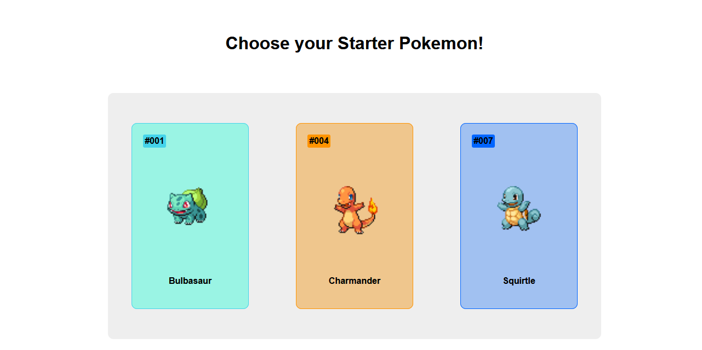
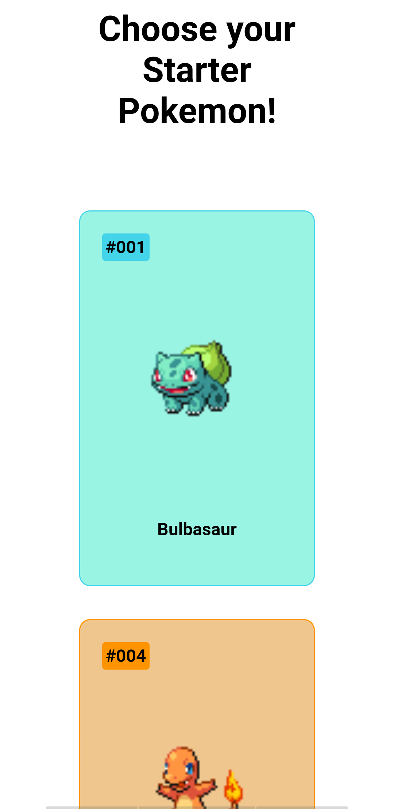

# Pokemon Cards

This folder consists of index.html and static folder

index.html
    This file is used to display three pokemon cards with id,image and name

Static folder consists of images and css folders

CSS folder consists of app.css

app.css
    This file is linked to index.html in frontend folder which is used for styling for that file

Images folder consists of three images
    Bulbasaur
    Charmandar
    Squirtle

[Click this Link to open](https://venkatpantham.github.io/edyst-s19-choose-a-pokemon/frontend/index.html)

Desktop Screenshot

Mobile Screenshot

